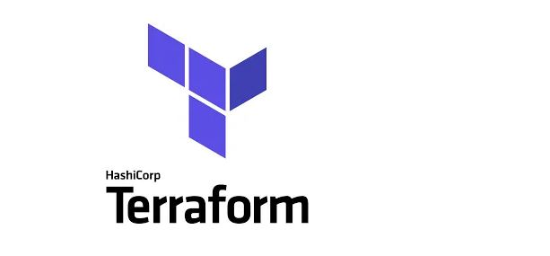
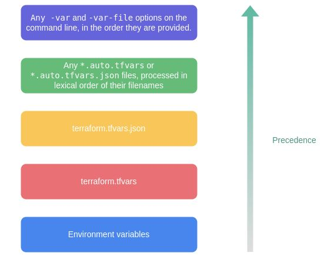

## 1. Terraform 简介

----------------------------------------------------------------------

[Terraform](https://www.terraform.io/)是一个开源工具，用于安全高效地预览、配置和管理(CRUD)多云基础架构和各类其他[资源](https://registry.terraform.io/browse/providers)。

Terraform是一个IT基础架构自动化编排工具，可以用代码来管理和维护IT资源。它编写了描述云资源拓扑的配置文件，例如虚拟机、负载均衡器。Terraform的命令行接口（Command Line Interface，CLI）提供一种简单机制，用于将配置文件部署到AWS、阿里云或其他任意支持的云上，并对其进行版本控制。

同时，Terraform是一个高度可扩展的工具，通过Terraform提供的SDK，编写Go代码，调用任意的API，实现[自研的provider](https://www.hashicorp.com/blog/writing-custom-terraform-providers)。也就是说只要提供了API，就可以成为一个provider。

## 2. 基本概念

-------------------------------------------------------------------------------------------

### 2.1 Provider

`provider`其实就是某个资源的API集合，比如[Alicloud Provider](https://registry.terraform.io/providers/aliyun/alicloud/1.173.0) 

初始化 provider，每种provider的初始化方式不一样，阿里云支持AK/SK, Credentials, etc.

```shell
# init with AK/SK
terraform {
  required_providers {
    alicloud = {
      source = "aliyun/alicloud"
      version = "1.156.0"
    }
  }
}

provider "alicloud" {
  access_key = "xxxxxxxxxxxxxx"
  secret_key = "xxxxxxxxxxxxxx"
  region = "cn-shanghai"
}
```

 ```shell
# init with profile, the path is $HOME/.aliyun/config.json
terraform {
  required_providers {
    alicloud = {
      source = "aliyun/alicloud"
      version = "1.156.0"
    }
  }
}

provider "alicloud" {
  region                  = "cn-shanghai"
  profile                 = "customprofile"
}
 ```

由于terraform本身的版本在不断升级，以及provider的版本升级，不同的版本组合下，terraform预览资源可能会出现不一样的视图。解决方法，[lock文件](https://www.terraform.io/language/files/dependency-lock)，`.terraform.lock.hcl`。 建议在git仓库下，将这个文件一并上传以此保证版本的一致性。

### 2.2 Resource

`resource`就是具体某一个API的调用，创建(Create)一个具体的资源，比如[VPC](https://registry.terraform.io/providers/aliyun/alicloud/latest/docs/resources/vpc)，[NAT Gateway](https://registry.terraform.io/providers/aliyun/alicloud/latest/docs/resources/nat_gateway)，[ECS](https://registry.terraform.io/providers/aliyun/alicloud/latest/docs/resources/instance)等。

```shell
resource "alicloud_vpc" "vpc" {
  vpc_name   = var.name
  cidr_block = "10.0.0.0/8"
}
```

### 2.3 Data Sources

`data`就是读取(Read/Retrieve)某个已经存在的可用资源，比如[虚拟机镜像](https://registry.terraform.io/providers/aliyun/alicloud/latest/docs/data-sources/images)

```shell
data "alicloud_images" "images_ds" {
  owners     = "system"
  name_regex = "^centos_6"
}
```

### 2.4 Variables

`variable` 就是定义参数(arguments)，terraform支持各种[类型](https://www.terraform.io/language/expressions/types)的参数。

```shell
variable "vpc_name" {
  type        = string
  description = "variable for vpc name"
  default     = "test_vpc"
}
```

terraform支持几种传递参数的方式，第一大类，自动传参。第二大类，手动传参。

自动传参： `terraform.tfvars`， `*.auto.tfvars` 

手动传参： `-var="instance_type=t2.large"`, `export TF_VAR_image_id=ami-abc123` , 最后在都没有找到的情况下，在交互界面上要求给出变量值



### 2.5 locals

有变量就会有常量，`locals`定义会重复使用到的常量。

```shell
locals {
  service_name = "forum"
  owner        = "Community Team"
}
```

### 2.6 Output

有了输入(var)，就会有输出。`output`支持输出具体的资源信息(attributes)。

```shell
output "vpc_id" {
  value = alicloud_vpc.vpc.id
}
```

### 2.7 State file

Terraform和Ansible一样，它们的操作都支持幂等性。这种幂等性其实是通过现实的状态与state file中的预期状态进行比对得到的。

Terraform支持两大类的state file，第一大类，本地state file。第二大类，远程state file。

本地state file： `terraform.tfstate`, `terraform.tfstate.backup`, 就你一个人用

远程state file： `state.tf` , 支持[AWS S3](https://www.terraform.io/language/settings/backends/s3)，[Alicloud OSS](https://www.terraform.io/language/settings/backends/oss), 适合团队开发，上传到git仓库，并且支持锁机制，可以确保互斥，同一时刻只能有一个人在CRUD云资源。

```shell
terraform {
  backend "oss" {
    bucket = "remote-state-dns"
    prefix = "mystate/state"
    key    = "terraform.tfstate"
    region = "cn-beijing"
  }
}
```

## 3. Terraform命令行(实战)

------------------------------------------------------

### 3.1 安装Terraform

安装terraform非常简单，支持手动安装下载zip包，解压zip包，添加到环境变量中即可。也支持在线安装，`apt-get install terraform`, 按照这篇[install guide](https://learn.hashicorp.com/tutorials/terraform/install-cli)即可。

### 3.2 Terraform 命令

#### 3.2.1 terraform init

进入到包含`tf`文件的目录下，初始化terraform，执行`terraform init`, 它会下载对应的provider，验证你的credential，初始化remote state file。

`-upgrade`参数决定是否升级模块代码以及provider版本

#### 3.2.2 terraform fmt

`terraform fmt`命令用来格式化Terraform代码文件的格式和规范，增加可读性。

#### 3.2.3 terraform validate

`terraform validate`命令用来检查目录下Terraform代码，只检查语法文件，不会真正访问远程资源。逻辑上对即可，并不会真正判断现实情况。

#### 3.2.4 terraform plan

`terraform plan`命令用来预览资源的变化情况，它会真正检查state file以及现实情况。比如新增(Create)一个资源，更新(Update)一个资源，删除(Destroy)一个资源。

`-out`参数将变更计划保存到指定路径下的文件中，随后可以使用terraform apply执行该计划

#### 3.2.5 terraform apply/destroy

`terraform apply`和`terraform destroy`命令是terraform真正干活的两个命令。apply命令用来生成执行计划(可选)并执行之，使得基础设施资源状态符合代码的描述。destroy命令用来销毁并回收所有Terraform管理的基础设施资源。

`-target`参数指定特定的某一个资源，当terraform已经管理了非常多的资源下，很有用

`-auto-approve`参数指定自动同意执行，慎用！建议在jenkinsfile中加入`input`来手动同意。

#### 3.2.6 terraform show

`terraform show`命令用来展示(Read)当前所有归terraform控制的资源的状态信息。

#### 3.2.7 terraform state

`terraform state`命令用来进行复杂的状态管理操作。直接修改state file是不推荐的，如果确实需要改动state file，使用`terraform state`命令来修改。

`terraform state list`: 列出所有资源的状态信息，同`terraform show` 

`terraform state show`: 列出具体某一个资源的状态信息

`terraform state mv`: 重命名一个资源

`terraform state rm`: 从状态文件中删除一个或多个对象，删除对象并非删除实际基础设施对象，而只是状态不再由Terraform管理，从状态文件中删除而已。

#### 3.2.8 terraform import

`terraform import`命令用来将已经存在的手动创建的资源对象导入Terraform，由terraform来控制。

## 4. Terraform Cloud

------------------------------------------------------------

[Terraform Cloud](https://www.terraform.io/cloud-docs)是一个帮助团队一起使用 Terraform 的应用程序。它在一个可靠的云上环境中运行Terraform，包括提供轻松访问tfstate、团队审批基础设施的更改、自动关联VCS(GitHub, GitLab, etc.)、云上资源预算评估、执行哨兵等功能。

Terraform官方提供了非常详尽的使用[guide](https://learn.hashicorp.com/tutorials/terraform/cloud-sign-up?in=terraform/cloud-get-started)，请自行参考guide进行实验。推荐[B站上的Terraform Cloud视频](https://www.bilibili.com/video/BV1ML411N7QD?spm_id_from=333.337.search-card.all.click&vd_source=d410ee9f043029e19d51c844fbb7caae)。

基本的使用步骤如下：

1. 登录Terraform Cloud

2. 新建一个 Org

   

3. 新建一个workspace，并且关联到GitHub repo

4. 设置AK/SK两个环境变量

   

5. 执行Plan/Apply

   

## 5. Terraform Module

------------------------------------------------------------

为了能够复用某些resource，terraform支持将一个目录下的所有tf文件封装成一个module。每个tf文件和平时的用法一致。然后通过关键字mudole来调用这个目录下的所有resource。

```shell
module "tsj_demo" {
  source = "git::https://jihulab.com/dhutsj/terraform-practice.git//alicloud_vpc_nat_sg?ref=main"

  vpc_name = var.vpc_name
}

```

阿里官方开源了非常多的[alicloud terraform modules](https://github.com/terraform-alicloud-modules)给大家使用。

## 6. 鸣谢及推荐

------------------------------------------------

非常感谢 DevOps 中国社区举办此次鉴宝活动，我才有这次机会和大家见面，很高兴认识这么多热爱开源的工程师。

如果在学习/使用Terraform时有任何疑问或想法，欢迎和我交流，微信(wechat)：dhutsj。

Terraform 版本管理工具 tfswitch: https://tfswitch.warrensbox.com/

Terraform 多环境管理工具 terragrunt: https://terragrunt.gruntwork.io/


